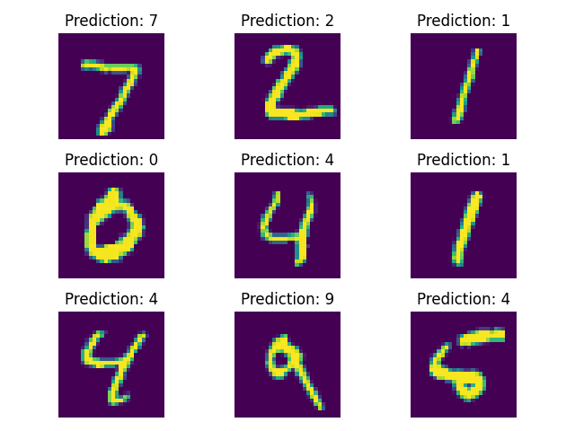

# simple-autodiff

A simple python library implementing a computation graph and automatic differentiation.

(*Solely written for self-educational purposes*)

## Example

```python
import autodiff as ad
from autodiff.utils import apply_grads, reset_grads
import numpy as np
```

Arrays are based on and can be created from numpy ndarrays. If gradients should be calculated during the backward pass the parameter track_grads has to be set to True.

```python
x = ad.Array([1, 2, 3, 4, 5, 6, 7, 8], name="x")
y = ad.from_numpy(np.array([3, 5, 7, 9, 11, 13, 15, 17]))

m = ad.Array(np.random.rand(), track_grads=True)
n = ad.Array(np.random.rand(), track_grads=True)
```

In Order to fit the functional model y=m*x+n the forward pass and error function have to be defined.

```python
def forward(x):
    return m*x + n

def error(output, target):
    return ad.mean((output - target)**2)
```

By default the computation graph will be rebuild on every iteration. Once the computation graph is build for the first time it can be reused by calling the eval() method. Values of nodes in the computation graph can be reset by specifying a numpy array on the eval method as a parameter with the Arrays name.

In order to track the computation graph operations have to be wrapped inside the track_computation() context manager.

To fit the weights (m, n) to the input data (x, y) utility methods to apply the gradients (apply_grads, gradient descent) and to zero the gradients (reset_grads) can be used.

```python
# first option
for i in range(0,100):
    with ad.track_computation():
        out = forward(x)
        loss = error(out, y)
    reset_grads(loss)
    loss.backward()
    apply_grads(loss, lr=0.01)

# second option
with ad.track_computation():
    out = forward(x)
    loss = error(out, y)
y.name = "y"
for i in range(0,100):
    loss.eval(x=x.value, y=y.value)
    reset_grads(loss)
    loss.backward()
    apply_grads(loss, lr=0.01)
```

## Benchmark on MNIST Dataset

As a real-world benchmark a feed-forward neural network with 3 layers is used to classify images in the MNIST dataset.

```python
def forward(img: ad.Array) -> ad.Array:
    i1 = ad.reshape(img, (784,1))
    i2 = weight1@i1 + bias1
    i3 = ad.sigmoid(i2)
    i4 = weight2@i3 + bias2
    i5 = ad.sigmoid(i4)
    i6 = weight3@i5
    i7 = ad.softmax(i6)
    return i7
```

The dataset is split into 60000 train-images and 10000 test-images. 
Mean-squared-error is used as the loss function, stochastic gradient descent with a batch size of 30 as the optimization algorithm.

Training for 10 epochs produced an accuracy of roughly 90% (data/test_accuracy.png).



A similar accuracy was obtained by training an equivalent network using pytorch (data/test_accuracy_pytorch.png).